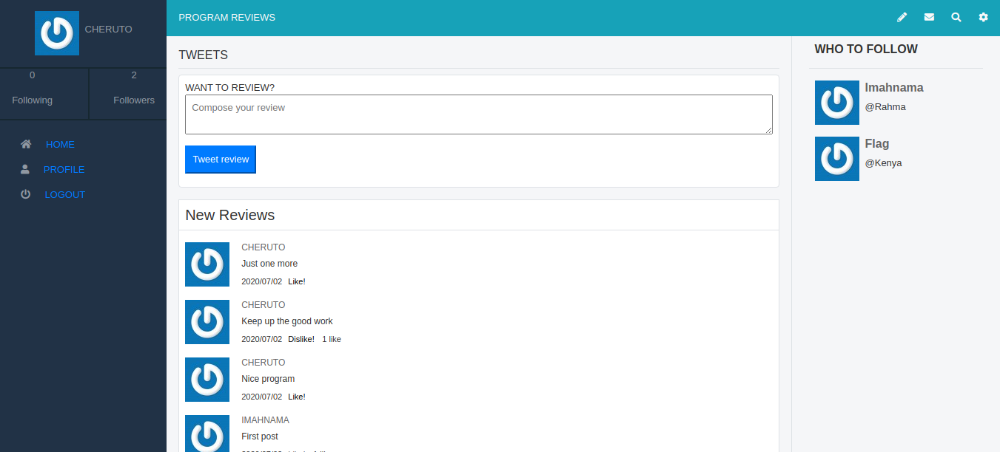
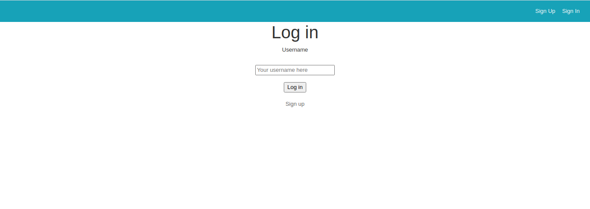

# Twitter Redesign - Ruby on Rails Capstone Project

- The app follows the following User Journey to build the MVP
1. The user logs in to the app, only by typing the username
2. The user is presented with the homepage
    1. Left-side menu.
    2. *Reviews* tab in the centre
    3. Right-side section with *Who to follow
3. The *Reviews* section includes:
    1. Simple form for creating an opinion.
    2. List of all reviews (sorted by most recent) that display review text and author details.
    3. The *Who to follow* section
4. When the user opens the profile page they can see:
    1. Left-side menu
    2. Cover picture and *Reviews* tab in the centre
    3. Right-side section with *Profile detailed info.*
6. The *Profile detailed info* section includes:
    1. User photo.
    2. Button to follow a user.
    3. Stats: total number of tweets, number of followers and number of following users.
    4. List of people who follow this user.
7. Create all the Three models and its associations
8. Connect Front End to Back End.
9. Test the models/features using Rspec.
10. Deploy app using Heroku.


## Screenshots of the View

### Homepage

### Userpage

### Log Up



## Built With

- Ruby v2.7
- Ruby on Rails v6.0.3
- Gems used for testing: Capybara, Rspec-Rails, Shoulda-matchers and FactoryBot


## Live Demo

[Heroku App Link](https://sheltered-bayou-21914.herokuapp.com/)

## Getting Started

To get a local copy up and running follow these steps:

### Prerequisites

- Ruby: 2.7
- Rails: 6.0.3
- Postgres: >=9.5
- Git

### Usage

- Fork/Clone this project to your local machine
- Open folder in your local environment and run these lines of code to get started:

Install gems with:

```Ruby
    bundle install
```

Setup database with:

```Ruby
   rails db:create
   rails db:migrate
```

Start server with:

```Ruby
    rails server
```

Then open a web page and go to [port 3000 on your local machine.](http://localhost:3000)

### Running tests

```Ruby
   bundle exec rspec
```

### Deployment

The application was deployed on heroku.
To deploy your own copy, you can follow the following [steps:](https://devcenter.heroku.com/articles/git)

## Authors

👤 **Phylis Chepchumba**

- Github: [@Phlylis05](https://github.com/phylischumba)
- Linkedin: [PhylisChepchumba](https://linkedin.com/PhylisChepchumba)
- Twitter: [chepchumba05](https://twitter.com/chepchumba05)

## 🤝 Contributing

Contributions and feature requests are welcome!

Start by:

- Forking the project
- Cloning the project to your local machine
- `cd` into the project directory
- Run `git checkout -b your-branch-name`
- Make your contributions
- Push your branch up to your forked repository
- Open a Pull Request with a detailed description to the development(or master if not available) branch of the original project for a review

## Show your support

Give a ⭐️ if you like this project!

## Acknowledgments
- You can access all the design info (color, typography, layouts) in this link: (https://www.behance.net/gregoirevella)

- Design Idea by [Gregoire Vella](https://www.behance.net/gregoirevella)
